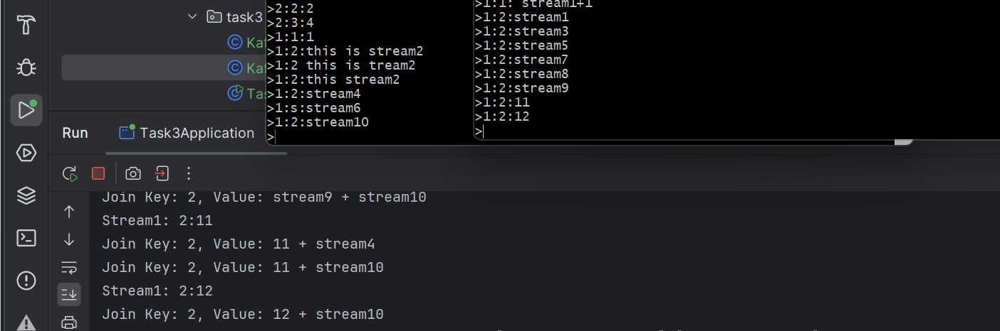

# Kafka Streams

## Quick Start

### Task3
```commandline
kafka-topics.sh --create --topic task3-1 --bootstrap-server localhost:9092,localhost:9093
kafka-topics.sh --create --topic task3-2 --bootstrap-server localhost:9092,localhost:9093

./kafka-configs.sh  --bootstrap-server localhost:9092,localhost:9093 --entity-type topics --entity-name task3-1 --alter --add-config retention.ms=3600000
./kafka-configs.sh  --bootstrap-server localhost:9092,localhost:9093 --entity-type topics --entity-name task3-2 --alter --add-config retention.ms=10000


kafka-console-producer.sh --broker-list localhost:9092,localhost:9093 --topic task3-1 --property "parse.key=true" --property "key.separator=:"
>> 1: today is
>> 2: tomorrow will be
kafka-console-producer.sh --broker-list localhost:9092,localhost:9093 --topic task3-2 --property "parse.key=true" --property "key.separator=:"
>> 1: a good day
>> 2: better

```

## Preparation

- Make sure you have Java 8+ installed.
- [Download](https://kafka.apache.org/downloads) the latest Kafka release and extract it.
- Start the Kafka environment (you can find the guide on how to do it [here](https://kafka.apache.org/quickstart)).
- Create 6 Kafka topics:

  ```
  task1-1
  task1-2
  task2
  task3-1
  task3-2
  task4
  ```

- Create a simple Spring Boot project using your favorite build tool. You can use [Spring Initializr](https://start.spring.io) for this.
- Make sure you have the following dependencies for Kafka in your build file:

  ```
  org.springframework.kafka:spring-kafka
  org.apache.kafka:kafka-streams
  org.apache.kafka:kafka-clients
  org.apache.kafka:kafka-streams-test-utils
  org.apache.kafka:kafka_2.13
  ```

  Also, ensure the dependencies version matches the Kafka environment version you set up.

## Tips to get started

All tasks can either be completed using one Spring Boot project or one project per task. It's preferable to have all tasks in one Spring Boot project and only separate them at class or package level.

Topic names are stored in the `application.properties` file. Topics can be created with the following command (the example is for Windows, for Unix-like operating systems use `kafka-topics.sh` instead of `kafka-topics.bat`):

```bash
kafka-topics.bat --create --bootstrap-server localhost:9092 --replication-factor 1 --partitions 1 --topic testTopic
```

Run the console producer client to write a few messages into your topic. By default, each line you enter will result in a separate message being written to the topic:

```bash
kafka-console-producer.bat --broker-list localhost:9092 --topic testTopic
```

Run the console consumer client to read the messages you created:

```bash
kafka-console-consumer.bat -bootstrap-server localhost:9092 -topic testTopic -from-beginning
```

To enable default Kafka Streams components you you simply need to add [the annotation](https://docs.spring.io/spring-kafka/api/org/springframework/kafka/annotation/EnableKafkaStreams.html) `@EnableKafkaStreams` to your application [Configuration](https://docs.spring.io/spring-framework/docs/current/javadoc-api/org/springframework/context/annotation/Configuration.html) class. If you have Kafka Streams JARs in your classpath, they will be picked up by the autoconfiguration. Here is a typical configuration for Kafka Streams in Spring Boot:

```java
@Configuration
@EnableKafka
@EnableKafkaStreams 
public class KafkaStreamsConfig {

   @Bean(name = KafkaStreamsDefaultConfiguration.DEFAULT_STREAMS_CONFIG_BEAN_NAME)
   public KafkaStreamsConfiguration kStreamsConfigs() {
      return new KafkaStreamsConfiguration(Map.of(
            APPLICATION_ID_CONFIG, "testStreams",
            BOOTSTRAP_SERVERS_CONFIG, "localhost:9092",
            DEFAULT_KEY_SERDE_CLASS_CONFIG, Serdes.Integer().getClass().getName(),
            DEFAULT_VALUE_SERDE_CLASS_CONFIG, Serdes.String().getClass().getName(),
            DEFAULT_TIMESTAMP_EXTRACTOR_CLASS_CONFIG, WallclockTimestampExtractor.class.getName()
      ));
   }
}
```

To build your Streams topology, you need a [StreamsBuilder](https://kafka.apache.org/34/javadoc/org/apache/kafka/streams/StreamsBuilder.html) as an input parameter. Spring Boot can create it with defaults or you can do it explicitly. Once you have your StreamsBuilder in place, you will get access to all of the APIs available in Kafka Streams and it becomes just like a regular Kafka Streams application.

```java
@Bean
public KStream<K, V> myFirstStream(StreamsBuilder kStreamBuilder) {
   KStream<integer, String> stream = kStreamBuilder.stream("streamingTopic");
   ...
   return stream;
}
```

Terminal operations, like `foreach(...)`, can be performed inside the bean that returns the Kafka stream:

```java
@Bean
public KStream<K, V> filteredStream(KStream<K, V> originalStream) {
    originalStream.foreach(...);
    return originalStream.filter(...);
}
```

Minimum required properties for the Kafka Streams application to implement the tasks:

```properties
spring.kafka.streams.application-id=my-kafka-streams-application
spring.kafka.streams.bootstrap-servers=localhost:9092
server.port=8081
```

Ensure that logging is enabled to help with troubleshooting.

```properties
logging.level.root=WARN
```

## Practical Tasks

1. We push any text data to the `task1-1` topic (via the command above) and expect to get the same data in the `task1-2` topic (20 points)
    - Implement functionality to read data from the topic `task1-1` and then transfer all data from the topic to the topic `task1-2`. The read data from the topic `task1-1` gets returned as a Stream.
    - When a Spring Application gets stopped, the application gracefully shutdowns Kafka Streams.

2. We push text data to `task2` (via the command above). Every message represents some sentence. We split the sentence into words, then we push the data into two our topics: for long and short words, and after that we merge the topics (20 points)
    - Implement functionality to read data from the topic `task2`
    - Then filter the data by value that the value is not `null`
    - After it, make several messages out of one if the source message is a sentence (otherwise we have a similar message: same value, but only with a changed key). The key in new messages is their value's length
    - Then print to the console every message after it all
    - After it, split the current Stream into two with the common name `words-` and additional names `short` (for messages whose value's length is less than 10 symbols), and `long` (all the rest).
    - Another Bean takes the final result of all actions above (it has to be `Map<String, KStream<Integer, String>> ...`) and filters out long and short messages by whether they contain the "a" letter or no
    - Finally, the results (two filtered Streams) get merged within a new Bean and every message gets printed to the console

   > 💡 **TIP**
   >
   > Use `flatMap` to create a few messages from one with your new key for messages (in our case it's their length), so the message
   >
   > ```json
    > { "key":null, "value":"abcd a1234 a0" }
    > ```
   >
   > gets transformed into 3 messages:
   >
   > ```json
    > { "key":4, "value":"abcd" }
    > { "key":5, "value":"a1234" }
    > { "key":2, "value":"a0" }
    > ```
   >
   > It doesn't matter what regex you pick to split sentences into words. We focus on Kafka Streams. The regex can be taken from, e.g, the FlatMap example on the link in the Lectures block.

3. Read data from two topics and then JOIN them with each other based on our Long key. Data in two topics is in the format `number:text`. The number is used as the Key to join messages from two topics. (20 points)
    - Implement functionality to read from both topics `task3-1` and `task3-2`
    - Once the data is read, it's (data from both topics) filtered out that the value is not null and value contains `:` (colon)
    - Then Streams with filtered data get a new key: the Long key. The key is formed from the value: we take the number from the value in the format `number:text` (i.e.: value = "1:hello world text", so "1" will form the key)
    - After receiving a new key for the Streams, we print every message (print key and value) to the console
    - JOIN (INNER JOIN) the first Stream with the second Stream based on the created keys. Messages have to be joined if and only if a difference between time when they appeared/were_pushed isn't more than 1 minute. The value of joined messages has to be in the following format: `left_value + <any_separator> + right_value`
    - In the JOIN add 30 seconds to join records which can be out of order
    - Print to the console every result of JOIN

4. Create a custom SerDe to handle messages with JSON data in the topic `task4` (20 points)
    - Implement a custom SerDe to handle JSON (String) messages (transform from JSON to our entity) in the topic with the following fields:

       ```json
       { "name":"John", "company":"EPAM", "position":"developer", "experience":5 }
       ```

    - Filter messages out to make sure that their value is not `null`
    - Read messages get printed to the console


    > 💡 **TIP**
    >
    > To implement a custom SerDe to handle JSON data you can take custom Serilizer and Deserializer from [here](https://www.baeldung.com/kafka-custom-serializer#dependencies-1) but add type to `...implements Serializer<YourType>...` (it's a mistake in the article)
    > After that you can use `Serdes.serdeFrom(new YourSerializer(), new YourDeserializer())`
    > If you accidentally push a malformed JSON message in the topic and then try to read with the implemented SerDe, your application might get stuck on reading the message with a constant error. Add the following property to your `application.properties` file to skip malformed messages:
    >
    > ```properties
    > spring.kafka.streams.properties.default.deserialization.exception.handler=org.apache.kafka.streams.errors.LogAndContinueExceptionHandler
    > ```

5. Write unit tests for the implemented functionality in the 2nd and 4th tasks (20 points)
    - Write unit tests for the functionality in the 2nd task
    - Write unit tests for the functionality in the 4th task

> 💡 **TIP**
>
> Here is an example of how to create a test for a bean with simple Kafka Streams logic.
>
> For the class like this
>
> ```java
> // MyClass.java
>
> @Bean
> public KStream<String, String> myStream(StreamsBuilder kStreamBuilder) {
>     return kStreamBuilder.stream(environment.getRequiredProperty("first.topic.name")...
> }
> ```
>
> We can write a test like this
>
> ```java
> // MyClassTest.java
>
> private Properties props;
>
> @Spy
> @InjectMocks
> private MyClass myClass;
>
> @Mock
> private Environment environment;
>
> @Before
> public void init() {
>     myClass = new MyClass();
> 
>     ...
> 
>     props = new Properties();
>     props.put(APPLICATION_ID_CONFIG, "my-test-app");
>     props.put(StreamsConfig.BOOTSTRAP_SERVERS_CONFIG, "dummy:9092");
> 
>     when(environment.getRequiredProperty("first.topic.name")).thenReturn("myTopic");
> }
>
> @Test
> public void ...() {
>     StreamsBuilder builder = new StreamsBuilder();
> 
>     MockApiProcessorSupplier<String, String, Void, Void> supplier = new MockApiProcessorSupplier<>();
>     myClass.myStream(builder).process(supplier);
> 
>     try (TopologyTestDriver driver = new TopologyTestDriver(builder.build(), props)) {
>         TestInputTopic<String, String> inputTopic = driver.createInputTopic("myTopic", Serdes.String().serializer(), Serdes.String().serializer());
>         inputTopic.pipeInput("testKey", "testValue");
>     } catch (Exception e) {
>         ...
>     }
> 
>     ArrayList<KeyValueTimestamp<String, String>> resultValues = supplier.capturedProcessors(3).get(2).processed();
>     assertEquals(1, resultValues.size());
>     assertEquals("testValue", (resultValues.get(0).value()));
>     ...
> }
> ```

- Apart from mentioned dependencies at the beginning of this text, you should also add some typical dependencies for unit tests, like these ones:

   ```
   org.powermock:powermock-api-mockito2:2.0.9
   org.powermock:powermock-module-junit4:2.0.9
   org.junit.vintage:junit-vintage-engine
   ```

or some other. It depends on what libraries you want to use for unit tests and their versions.

## Optional Tasks:

1. Learning topology and optimizing Kafka Streams application
    - Print Kafka Streams topology and enable Kafka logs to find the number of tasks created with your topology
    - Based on the topology and number of tasks set an optimal number of threads for your application
    - Optimize your topology with some built-in option

2. Monitoring of Kafka Streams application with Prometheus
    - Add required typical dependencies for metrics:

       ```
       io.micrometer:micrometer-registry-prometheus
       org.springframework.boot:spring-boot-starter-actuator
       ```

    - Download and install Prometheus (see [these installation instructions](https://prometheus.io/docs/prometheus/latest/installation/) for more details)
    - Expose Kafka Streams metrics to Prometheus with a configuration like this:

       ```yaml
       - job_name: 'Kafka Streams'
         metrics_path: '/actuator/prometheus'
         static_configs:
         - targets: ['localhost:8081']
       ```

    - Observe various metrics with with `kafka_consumer_fetch_manager_records...` prefix and try to answer the following questions:

        - Show how big the current message lag is
        - Show max message lag
        - Show how many messages have been processed

    - List those metrics somewhere (in txt file, for example)

   > 💡 **TIP**
   >
   > To enable metrics add the following dependencies:
   >
   > ```
    > org.springframework.boot:spring-boot-starter-actuator
    > org.springframework.boot:spring-boot-starter-web
    > io.micrometer:micrometer-registry-prometheus
    > javax.xml.bind:jaxb-api
    >```

## References

1. [Kafka Documentation](https://kafka.apache.org/documentation/)
2. [Kafka Streams With Spring Boot](https://www.baeldung.com/spring-boot-kafka-streams)