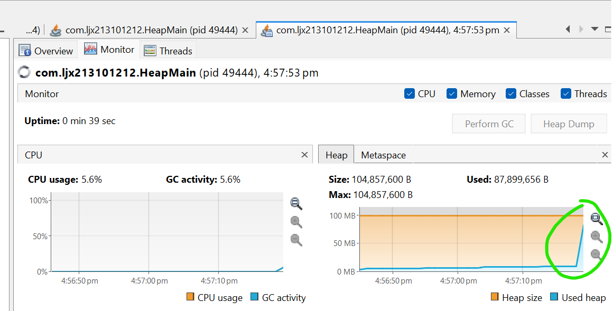

## OutOfMemory (OOM) error troubleshooting

#### Get OOM error
Execute and press any key:
```
    java -jar -Xmx100m heap-1.0.0-SNAPSHOT.jar
```

Note: 
```commandline
-Xmx: This is the flag to set the maximum heap size that the JVM is allowed to allocate.
```

```
Press any key to proceed
u
Exception in thread "main" java.lang.OutOfMemoryError: Java heap space
```

#### Use jvisualvm to observe OOM
- Execute:

```
    java -jar -Xmx100m heap-1.0.0-SNAPSHOT.jar
```
- In jvisualvm connect to our java process
- Go to "Monitor" tab
- Press any key in our application
- Observe how heap grows

answer
```commandline
the peak is always 100 MB 
```

#### Get heap dump
##### Using -XX:+HeapDumpOnOutOfMemoryError option
- Execute and press any key:

```
    java -jar -Xmx100m -XX:+HeapDumpOnOutOfMemoryError heap-1.0.0-SNAPSHOT.jar
```

```
java_pid10284.hprof generated and it can be opened by VisualVM 2.1.9
```

##### [Optional] Using jcmd
Get pid using `jps` here and further through this document:
```
    jps -lvm
```
jps -lvm | grep ljx213101212

28064 com.ljx213101212.HeapMain -Xmx100m -Dvisualvm.id=1647171737147600 -javaagent:C:\Apps\intellij\lib\idea_rt.jar=65461:C:\Apps\intellij\bin -Dfile.encoding=UTF-8 -Dsun.stdout.encoding=UTF-8 -Dsun.stderr.encoding=UTF-8
```commandline

```


```
    jcmd <pid> GC.heap_dump <filename>
```

```commandline
jcmd 28064 GC.heap_dump hello_world
```

##### [Optional] Using jmap
```
    jmap -dump:format=b,file=snapshot.hprof <pid>
```

#### Get heap histogram
##### Using jcmd
```
    jcmd <pid> GC.class_histogram
```
##### Using jmap
```
    jmap -histo <pid> 
```

#### Analyze heap dump
##### Using Java Visual VM
- Open retrieved heap dump in jvisualvm
- Identify memory leak


##### OQL
Execute OQL in jvisualvm:
```
    select objs from java.lang.Object[] objs where objs.length > 100
    select referrers(objs) from java.lang.Object[] objs where objs.length > 100
    select referrers(arr) from java.util.ArrayList arr where arr.size > 100
```
Startup `jhat` (note: `jhat` was decommissioned in JDK 9)
```
    jhat <head_dump.hprof>
```
Execute OQL in jhat
```
    select [objs, objs.length] from [Ljava.lang.Object; objs where objs.length > 100
    select referrers(objs) from [Ljava.lang.Object; objs where objs.length > 100
    select referrers(arr) from java.util.ArrayList arr where arr.size > 100
```
Please note small OQL syntax difference in jhat and jvisualvm.