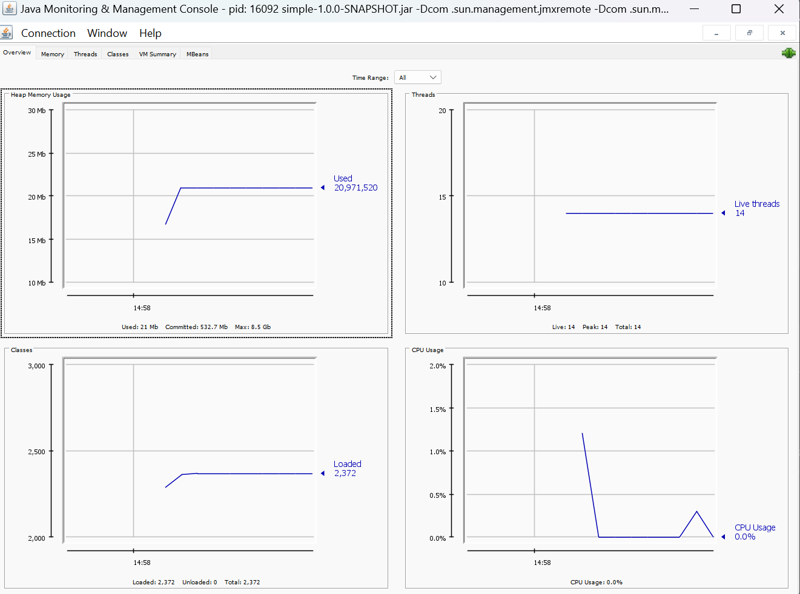

## Remote JVM profiling
Using [JMX Technology](https://docs.oracle.com/javase/8/docs/technotes/guides/management/agent.html)

For insecure remote connection use parameters:
```
    -Dcom.sun.management.jmxremote
    -Dcom.sun.management.jmxremote.port=7890
    -Dcom.sun.management.jmxremote.authenticate=false
    -Dcom.sun.management.jmxremote.ssl=false
```
```
    java -jar .\simple\target\simple-1.0.0-SNAPSHOT.jar -Dcom.sun.management.jmxremote -Dcom.sun.management.jmxremote.port=7890 -Dcom.sun.management.jmxremote.authenticate=false -Dcom.sun.management.jmxremote.ssl=false 
```
Connect to JVM using jconsole:
```
    jconsole localhost:7890
```

